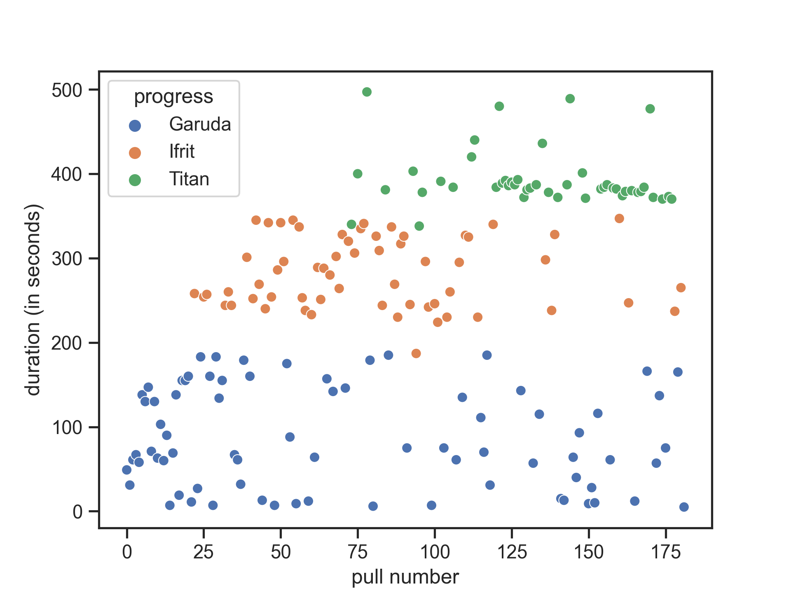

ffxiv visualizer
================

This is a tool that goes through your logfiles, extracts fights and stores
them in a local mongodb.

`visualize_uwu.py` goes through all combat entries from uwu and visualizes them.

Since this tool puts your data in a mongodb, you can also use tools like MongoDB 
Compass for information gathering.

## installation

- Download this project
- Install the requirements
`python3 -m pip install -r requirements.txt`
- Install mongodb from https://www.mongodb.com/try/download/community
- Change the log path in `config.py` to whatever path you use 

You can then run it with `python3 visualize_uwu.py`